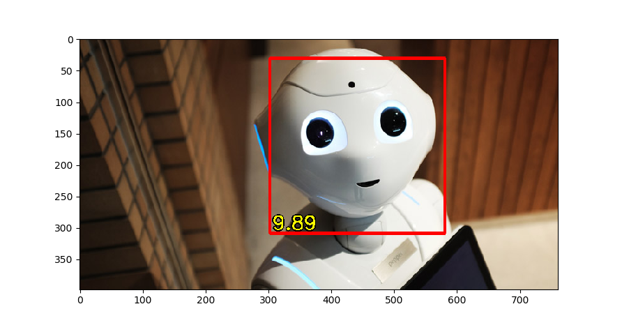

# Beholder

"Beauty is in the eye of the beholder" as the saying goes.  Well now
that task has been automated as well.

Beholder is a neural network trained to rate faces in images.  The
network was trained using the rated image data provided by
[South China University of Technology](https://github.com/HCIILAB/SCUT-FBP5500-Database-Release).

## Prerequisites

The following python packages are required:

    * keras
    * matplotlib
    * opencv
    * pillow
    * pydot
    * tensorboard

## Training

Training the network is a two-stage process.

1.  First the last few layers need to be trained.  The MobileNet
    weights are held constant, while only the new layers are mutable.

        python train.py

    The final weights are stored in train.h5.

    Checkpoints occur at each epoch and are stored in the files
    train.{epoch}-{loss}.hdf5.

    Information is also stored for Tensorboard in the logs/train
    directory.

2.  Then the full network is fine tuned and all weights are mutable.

        python fine-tune.py

    The final weights are stored in fine-tune.h5.

    Like training, checkpoints occur at each epoch and are stored in
    the files fine-tune.{epoch}-{loss}.hdf5.

    Tensorboard information is stored in the logs/fine-tune directory.

3.  Tensorboard may be used to visualize training statistics.

        tensorboards --logdir logs

## Testing

To view rating information on photos run:

    python test.py <file1.jpg> [file2.jpg file3.jpg ...]

All detected faces will be highlighted in rectangles with the
associated rating.
